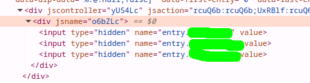

# form-to-google

[](https://badge.fury.io/js/form-to-google)
[](https://github.com/sanin-mn/form-to-google/stargazers)

##  Overview
`form-to-google` allows you to easily send data from an HTML form to a **Google Form** and have it saved to **Google Sheets** automatically. This is useful for integrating your website forms directly with Google Sheets without needing to write server-side code.

## 💻 Installation

To install the package, run:

```bash
npm install form-to-google
```

## How to use

### 1. Create a Google Form 

* Create a Google Form (e.g., a contact form).
* Go to Google Forms and right-click on the Submit button of your form.
* Copy the Form Response URL.

For example, your form URL might look like:
`https://docs.google.com/forms/d/e/YOUR_FORM_ID/formResponse`


### 2. Map Your Form Fields to Google Form

* In your Google Form, each input field has an associated `entry.xxxxx` ID that will be used to map your form fields. To get the `entry.xxxxx` IDs, inspect the Google Form source code (Right-click -> Inspect on the input field).


### 3. Connect Your HTML Form to Google Form Using form-to-google

```html
<form id="contactForm">
  <input name="name" placeholder="Your Name" required />
  <input name="email" type="email" placeholder="Your Email" required />
  <button type="submit">Submit</button>
</form>

<script type="module">
  import { connectForm } from 'form-to-google';

  const form = document.getElementById('contactForm');

  // Use the Google Form's POST URL and map the form fields to Google Form fields
  connectForm(form, {
    googleFormUrl: 'https://docs.google.com/forms/d/e/YOUR_FORM_ID/formResponse',  // Replace with your form's URL
    fieldMapping: {
      name: 'entry.1234567890',   // Replace with your Google Form entry ID for the 'name' field
      email: 'entry.0987654321'   // Replace with your Google Form entry ID for the 'email' field
    }
  });
</script>
```

### ✅ How it works:
* When a user submits the form, the data will be sent to your **Google Form** automatically.
* This also stores the data in the associated **Google Sheets** linked to the Google Form.